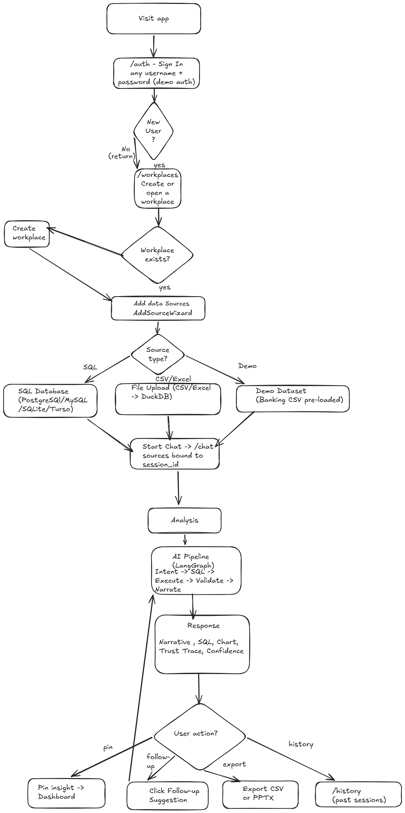
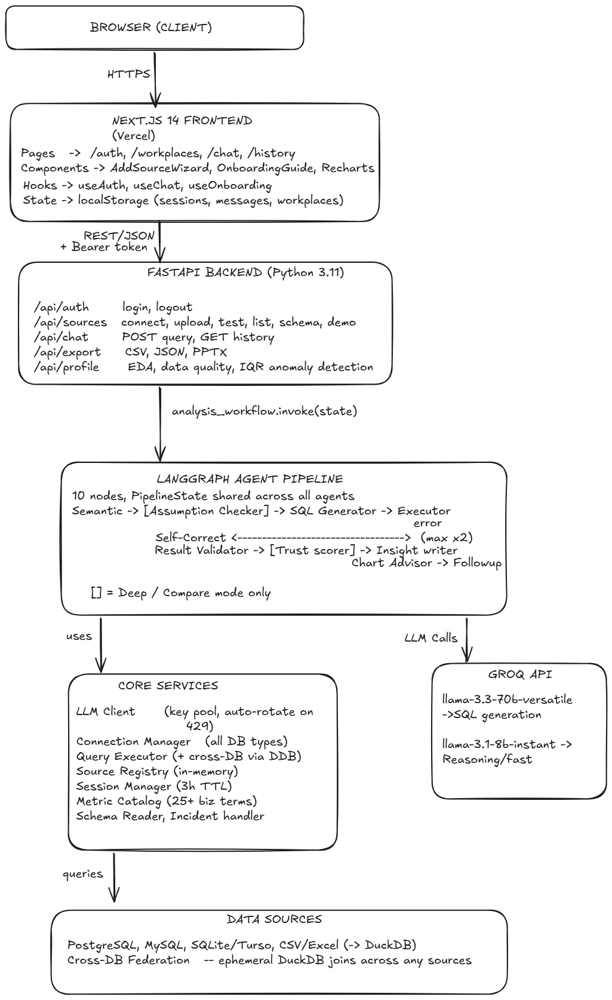
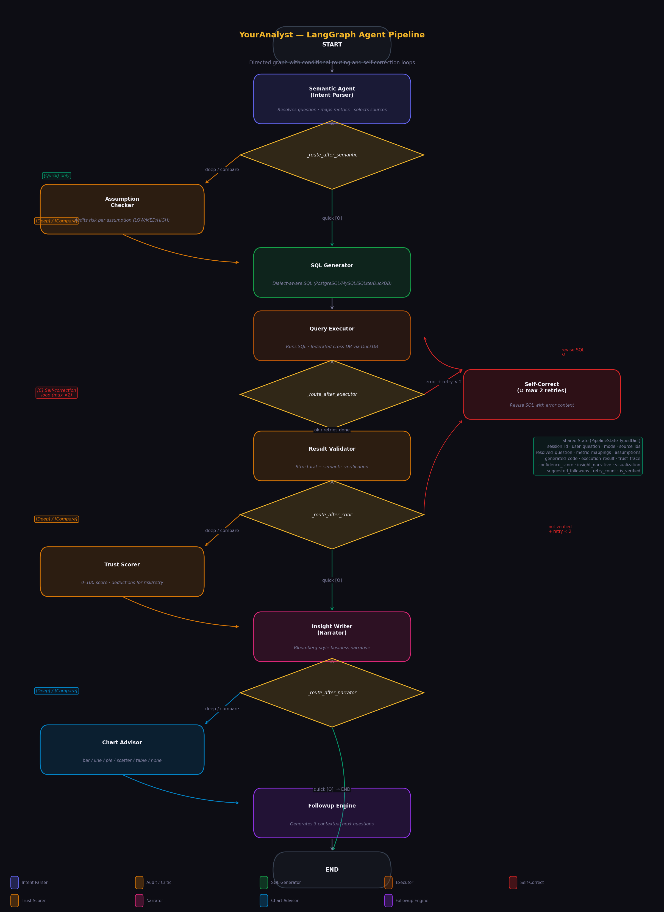

<div align="center">


# YourAnalyst

**Talk to your data. Understand every answer.**

A self-service analytics platform where you type a question in plain English and receive a verified, explainable answer — complete with charts, confidence scores, and a transparent audit trail of every decision the AI made.

<br/>

[](LICENSE)
[](https://python.org)
[](https://nodejs.org)
[](https://langchain-ai.github.io/langgraph/)
[](https://console.groq.com)
[](https://natwestgroup.com)
[](https://your-analyst-3z2p.vercel.app/)
[](https://youranalyst-8985.onrender.com/)

<br/>

### 🌐 Frontend &nbsp;→&nbsp; [https://your-analyst-nine.vercel.app](https://your-analyst-nine.vercel.app/)
### ⚙️ Backend API &nbsp;→&nbsp; [https://youranalyst-8985.onrender.com](https://youranalyst-8985.onrender.com/)

<sub>Enter any username to sign in — no password needed.</sub>

<br/>

</div>

---

## 📋 Table of Contents

- [Overview](#-overview)
- [Key Features](#-key-features)
- [Architecture](#-architecture)
- [LangGraph Pipeline](#-langgraph-pipeline)
- [Tech Stack](#-tech-stack)
- [Project Structure](#-project-structure)
- [Quick Start](#-quick-start)
- [Configuration](#-configuration)
- [Usage Examples](#-usage-examples)
- [API Reference](#-api-reference)
- [Tests](#-tests)

---

## 🔍 Overview

Getting answers from databases today is slow. You either write SQL yourself, wait for an analyst, or trust a dashboard that may not answer the exact question you have. **YourAnalyst** changes that.

Connect any database — PostgreSQL, MySQL, SQLite, or upload a CSV — and start asking questions in everyday language. Behind the scenes, a pipeline of 10 specialised AI agents collaborates to understand your intent, write the correct SQL, execute it, validate the result, and deliver a clear business narrative with a chart and a 0–100% confidence score.

Every answer comes with a **Trust Trace**: a step-by-step audit trail showing which sources were queried, what assumptions were made, how the SQL was generated, and whether the result passed structural and semantic verification. Nothing is a black box.

**Built for:** Business analysts, product managers, team leads — anyone who needs fast, credible data insights without writing code.

**How to sign in:** Enter any username on the login screen. No password is needed.


**Example questions you can ask:**
```
"What are the top 5 spending categories by total amount?"
"Compare Q1 vs Q2 revenue growth this year"
"How many fraud alerts were triggered last month?"
"Show me the loan portfolio breakdown by status"
"Which customer accounts have the highest balance?"
```

---

## ✨ Key Features

### Workspaces & Data Connections

| Feature | What it does |
|---|---|
| **Workplaces** | Organise data sources into named workplaces, each with its own connections and isolated chat context. |
| **Multi-Source Querying** | Connect PostgreSQL, MySQL, SQLite, or upload CSV/Excel files — ask questions that span across all connected sources in a single conversation. Excel workbooks load every sheet as a separate table. |
| **Conversation History** | Past chats are grouped by workplace — revisit any previous analysis with the full thread intact. |
| **Guided Onboarding** | First-time users see a step-by-step tour of workplaces, source connections, the chat bar, and all analytics panels. |

### Explore & Understand Your Data

| Feature | What it does |
|---|---|
| **Schema Explorer** | Browse every table and column across all connected sources in a searchable panel with type labels and PK/FK/NOT NULL badges (from database constraints where available; heuristics for file-based sources). Schema is cached in-session so switching tabs does not refetch. |
| **Relationship Inference** | The **Relationships** tab scores likely joins between tables using four signals: column name similarity, Jaccard value overlap, cardinality (PK/FK hints), and ID naming patterns. Only relationships with **≥ 60%** confidence are shown. Results are cached in-session after the first load. |
| **Data Glossary** | Add plain-English descriptions to any column directly in the Schema Explorer. Descriptions persist locally and grow into a reusable data dictionary. |
| **Auto Data Profiling** | Scan any source with one click to compute row counts, distinct values, null percentages, min/max/mean, and max string lengths per column. |
| **Data Quality Report** | See completeness scores, high-null column flags, and duplicate row counts displayed as summary cards for each table. |
| **Anomaly Detection** | IQR-based outlier analysis runs on every numeric column and reports outlier counts, Q1/Q3 bounds, and fence values. |

### Ask Questions, Get Verified Answers

| Feature | What it does |
|---|---|
| **Natural Language Querying** | Ask any data question in plain English. A pipeline of 10 AI agents translates it to SQL, runs it, and returns a clear narrative answer with a chart. |
| **Self-Correcting SQL Engine** | If the generated SQL fails or returns the wrong result, the system automatically rewrites it — up to 2 retries — without the user seeing an error. |
| **Semantic Metric Layer** | Business terms like "revenue", "churn", and "active users" are mapped to consistent SQL expressions so the same word always means the same thing. |
| **Automatic Visualisation** | The system picks the best chart type (bar, line, pie, scatter) based on the data shape and renders it inline with the answer. |
| **Follow-up Suggestions** | Three contextual next questions appear as clickable chips after every answer to keep the exploration going. |

### Trust & Transparency

| Feature | What it does |
|---|---|
| **Trust Trace** | Every answer includes a collapsible breakdown showing each agent's reasoning — what was assumed, how the SQL was built, whether the result was verified, and the final confidence score. |
| **0–100% Confidence Score** | Each response carries a trust rating with visible deductions: risky assumptions (−15), retries (−10), low row counts (−5). Scores below 70% show a warning. |
| **SQL Transparency** | Every response has a collapsible "View SQL" card showing the formatted query, the database dialect, a plain-English explanation, and a one-click copy button. |
| **Credential Masking** | Database connection strings are redacted before storage or display — no passwords ever appear in responses or logs. |

### Save, Export & Report

| Feature | What it does |
|---|---|
| **Pinned Insights** | Pin any answer to a persistent mini-dashboard that stores the narrative, confidence score, chart, data table, and original question. |
| **Report Builder (PPTX)** | Export all pinned insights as a polished PowerPoint — includes a title slide, one slide per insight with a native chart, and data table slides. |
| **CSV Export** | Download any result table as a CSV file directly from the chat. |

### Under the Hood

| Feature | What it does |
|---|---|
| **LLM Key Rotation** | A pool of Groq API keys rotates automatically on rate-limit errors to maximise uptime on the free tier. |
| **Glassmorphism Dark UI** | Frosted-glass dark theme across every surface — navbar, modals, cards, chat bar, and tabs — designed for extended use. |

---

## 🏗 Architecture

Diagrams are PNG files in [`docs/images/`](./docs/images/). Regenerate them when the architecture changes.

### User Journey

How a user moves through the product — from sign-in through workspace setup, source connection, and conversational analysis.



---

### System Architecture

Browser, Next.js frontend, FastAPI, LangGraph pipeline, core services, Groq LLMs, and connected data sources.



---

## 🤖 LangGraph Pipeline

Every user question passes through a **10-node LangGraph DAG**. Each node does one job, appends to a shared `PipelineState`, and adds an entry to the **Trust Trace** in the UI.



| Node | File | What it does |
|---|---|---|
| **1. Intent Parser** | `pipeline/intent_parser.py` | Resolves the user's intent, selects relevant sources, maps business terms to SQL expressions via the Metric Dictionary, and flags assumptions as SAFE / RISKY / UNKNOWN. |
| **2. Assumption Checker** | `pipeline/assumption_checker.py` | Audits each assumption with a risk rating (LOW / MEDIUM / HIGH) and mitigation strategy. Feeds deductions into the Trust Scorer. |
| **3. SQL Generator** | `pipeline/sql_generator.py` | Writes dialect-aware SQL (PostgreSQL, MySQL, SQLite, DuckDB) using the resolved intent and full schema context. Powered by Llama 3.3 70B. |
| **4. Executor** | `pipeline/workflow.py` | Runs the SQL against the connected database via SQLAlchemy or DuckDB. Returns columns, rows, and row count (capped at 500). |
| **5. Self-Corrector** | `pipeline/sql_generator.py` | On execution error or semantic failure, injects the error message + schema into the prompt and rewrites the SQL. Up to 2 retries. |
| **6. Result Validator** | `pipeline/result_validator.py` | Two-layer check: structural (non-empty, no nulls, no error) then semantic (LLM verifies the result actually answers the question). Failures route back to node 5. |
| **7. Trust Scorer** | `pipeline/trust_scorer.py` | Computes a 0–100% confidence score. Deductions: RISKY assumption (−15), UNKNOWN assumption (−10), retry (−10), low row count (−5). |
| **8. Insight Writer** | `pipeline/insight_writer.py` | Converts raw results into a confident, jargon-free business narrative with exact figures. No mention of SQL, tables, or rows. |
| **9. Viz Advisor** | `core/chart_advisor.py` | Picks the best chart type (bar, line, pie, scatter, or text card) based on the result shape. |
| **10. Follow-up Engine** | `pipeline/suggestion_engine.py` | Generates 3 contextual next questions displayed as clickable chips below the answer. |

---

## 🛠 Tech Stack

### Backend (Python 3.11+)

| Technology | Version | Purpose |
|---|---|---|
| FastAPI | 0.111+ | REST API framework — endpoints for auth, chat, sources, profiling, relationship inference, export |
| LangGraph | 1.1+ | DAG orchestration of the 10-node agent pipeline |
| LangChain Core | 1.2+ | Shared abstractions used by LangGraph nodes |
| Groq SDK | 0.9+ | LLM inference — calls Llama 3.3 70B (SQL, narration) and Llama 3.1 8B (scoring, follow-ups) |
| SQLAlchemy | 2.0+ | Database connections and query execution for PostgreSQL, MySQL, SQLite |
| psycopg2 | 2.9+ | PostgreSQL adapter |
| PyMySQL | 1.1+ | MySQL adapter |
| libsql-client | latest | Turso / LibSQL adapter |
| DuckDB | 0.10+ | In-memory analytics engine for CSV and Excel files |
| pandas | 2.2+ | Data manipulation for file uploads and profiling |
| openpyxl | 3.1+ | Excel (.xlsx) file parsing |
| Pydantic | 2.11+ | Request/response validation and serialisation |
| python-dotenv | 1.0+ | Environment variable loading |
| Uvicorn | latest | ASGI server |

### Frontend (Node.js 20+)

| Technology | Version | Purpose |
|---|---|---|
| Next.js | 14.2 | React framework with App Router — SSR, routing, API proxy |
| React | 18 | UI component library |
| Recharts | 2.12 | Chart rendering (bar, line, pie, scatter) |
| react-dropzone | 14.2 | Drag-and-drop file upload in the source wizard |
| Tailwind CSS | 3.4 | Utility-first CSS framework (used alongside custom glassmorphism styles) |
| PptxGenJS | 3.12 (CDN) | Browser-side PowerPoint generation — loaded on demand, not bundled |
| TypeScript | 5 | Type safety across all frontend code |

### Infrastructure

| Technology | Purpose |
|---|---|
| Groq Cloud API | LLM inference (free tier with key rotation) |
| localStorage | Client-side persistence for sessions, workplaces, history, pins, glossary |

---

## 📁 Project Structure

```
youranalyst/
│
├── backend/                         # FastAPI application
│   ├── pipeline/                    # LangGraph agent nodes
│   │   ├── workflow.py              # Pipeline DAG definition & routing logic
│   │   ├── state_schema.py          # Shared state schema (TypedDict)
│   │   ├── intent_parser.py         # Intent resolution & source selection
│   │   ├── assumption_checker.py    # Deep risk audit (Deep/Compare only)
│   │   ├── sql_generator.py         # SQL generation + self-correction
│   │   ├── result_validator.py      # Structural + semantic verification
│   │   ├── trust_scorer.py          # 0–100% trust score computation
│   │   ├── insight_writer.py        # Business narrative generation
│   │   └── suggestion_engine.py     # Contextual follow-up suggestions
│   │
│   ├── endpoints/                   # FastAPI route handlers
│   │   ├── authentication.py        # Login / session endpoints
│   │   ├── conversation.py          # /api/chat — main pipeline trigger
│   │   ├── datasources.py           # Data source connect/disconnect/list
│   │   ├── profiling.py             # Data profiling, quality & anomaly detection
│   │   └── downloads.py             # CSV export endpoint
│   │
│   ├── core/                        # Core service layer
│   │   ├── llm_client.py            # LLM client + key rotation pool
│   │   ├── query_executor.py        # Query execution + cross-DB joins
│   │   ├── connection_manager.py    # Database connection & schema extraction
│   │   ├── relationship_inference.py # Multi-signal join inference (name, overlap, cardinality, ID patterns)
│   │   ├── schema_reader.py         # Table/column metadata utilities
│   │   ├── metric_catalog.py        # Business term → SQL mapping
│   │   ├── chart_advisor.py         # Chart type selection logic
│   │   ├── session_manager.py       # In-memory session management
│   │   ├── source_registry.py       # Connected source registry
│   │   └── incident_handler.py      # Email error reporting
│   │
│   ├── contracts/
│   │   └── request_models.py        # Pydantic request/response models
│   │
│   ├── guards/
│   │   └── token_guard.py           # Session token validation
│   │
│   ├── helpers/
│   │   ├── log_factory.py           # Structured logging setup
│   │   └── redactor.py              # Credential masking utilities
│   │
│   ├── tests/
│   │   ├── test_agents.py           # Agent pipeline unit tests
│   │   ├── test_data_engine.py      # Query execution tests
│   │   └── test_sources.py          # Source connection tests
│   │
│   ├── tools/
│   │   └── bootstrap_sample_db.py   # SQLite demo database initializer
│   │
│   ├── app.py                       # FastAPI app entry point
│   ├── server.py                    # Dev runner
│   ├── requirements.txt             # Python dependencies
│   └── .env.example                 # Environment variable template
│
├── frontend/                        # Next.js 14 application
│   ├── app/                         # App Router pages
│   │   ├── layout.tsx               # Root layout (navbar, global providers)
│   │   ├── globals.css              # Global styles (glassmorphism theme)
│   │   ├── page.tsx                 # Landing / redirect
│   │   ├── auth/page.tsx            # Login page (username only)
│   │   ├── chat/page.tsx            # Main chat interface
│   │   ├── workplaces/page.tsx      # Workplace & data source management
│   │   └── history/page.tsx         # Query history (grouped by workplace)
│   │
│   ├── components/
│   │   ├── AddSourceWizard.tsx      # Multi-step source connection UI
│   │   └── OnboardingGuide.tsx      # First-time user walkthrough
│   │
│   ├── hooks/
│   │   ├── useChat.ts               # Chat state management
│   │   ├── useAuth.ts               # Authentication state
│   │   └── useOnboarding.tsx        # Onboarding flow state
│   │
│   ├── lib/
│   │   ├── api.ts                   # Typed API client
│   │   └── types.ts                 # TypeScript type definitions
│   │
│   ├── public/sample/               # Sample CSV files for demo
│   │   ├── employees.csv
│   │   └── sales_data.csv
│   │
│   ├── package.json
│   ├── next.config.mjs
│   ├── tailwind.config.ts
│   ├── tsconfig.json
│   └── .env.example
│
├── sample_data/                     # Banking demo datasets (CSV)
│   ├── bank_transactions.csv        # Transaction records
│   ├── customer_accounts.csv        # Account balances
│   ├── fraud_alerts.csv             # Fraud detection logs
│   ├── loan_portfolio.csv           # Loan status breakdown
│   └── monthly_revenue.csv          # Revenue time series
│
├── docs/                            # Additional documentation
│   ├── architecture.md              # Detailed architecture notes (if present)
│   └── images/                      # Diagram PNGs (referenced in README Architecture)
│       ├── user_flow.png            # User journey / sign-in to chat
│       ├── system_architechture.png # System architecture (spelling as on disk)
│       └── langgraph_pipeline.png   # LangGraph agent pipeline
│
├── .env.example                     # Root environment template
├── .gitignore
├── LICENSE                          # Apache 2.0
└── README.md
```

---

## 🚀 Quick Start

### Prerequisites

- **Python 3.11+**
- **Node.js 20+**
- **One or more free Groq API keys** — get them at [console.groq.com](https://console.groq.com) (no credit card needed)

---

#### 1. Clone the repository

```bash
git clone https://github.com/Abhay-BITS/datawhisperer-natwest.git
cd datawhisperer-natwest
```

#### 2. Backend setup

```bash
cd backend

# Create a virtual environment
python -m venv .venv
source .venv/bin/activate          # macOS/Linux
# .venv\Scripts\activate           # Windows

# Install dependencies
pip install -r requirements.txt

# Configure environment
cp .env.example .env
```

Open `.env` and set your Groq key(s):
```env
GROQ_API_KEYS=gsk_your_key_1_here,gsk_your_key_2_here
```

Start the backend:
```bash
uvicorn app:app --reload --port 8000
```

API will be live at `http://localhost:8000`
Interactive docs at `http://localhost:8000/docs`

#### 3. Frontend setup

```bash
# Open a new terminal
cd frontend

# Install dependencies
npm install

# Configure API URL (optional — defaults to localhost:8000)
cp .env.example .env.local

# Start dev server
npm run dev
```

Open [http://localhost:3000](http://localhost:3000) — enter any username to sign in (no password required).

---

## 🔧 Configuration

All configuration is via environment variables. **Never commit your `.env` file.**

### Backend (`backend/.env`)

```env
# ── Required ─────────────────────────────────────────────────────────
GROQ_API_KEYS=gsk_key1_here,gsk_key2_here,gsk_key3_here

# ── Optional: Error Reporting ─────────────────────────────────────────
FEEDBACK_EMAIL=your_email@example.com
SMTP_HOST=smtp.gmail.com
SMTP_PORT=587
SMTP_USER=your_email@gmail.com
SMTP_PASS=your_app_password

# ── Optional: Cloud Database Connections ─────────────────────────────
SUPABASE_HOST=your-project.supabase.co
SUPABASE_USER=postgres
SUPABASE_PASSWORD=your_password
SUPABASE_DATABASE=postgres

TIDB_HOST=your-cluster.tidbcloud.com
TIDB_USER=your_user
TIDB_PASSWORD=your_password
TIDB_DATABASE=your_database

TURSO_HOST=your-db.turso.io
TURSO_AUTH_TOKEN=your_token
```

### Frontend (`frontend/.env.local`)

```env
# Local development
NEXT_PUBLIC_API_URL=http://localhost:8000

# Production (deployed on Render)
# NEXT_PUBLIC_API_URL=https://youranalyst-8985.onrender.com
```

---

## 💬 Usage Examples

### Connecting a Data Source

1. Sign in with any username on the `/auth` page.
2. Create a new **Workplace** — a workspace that groups related data sources together.
3. Click **Add Data Source** and choose one of:
   - **SQL Database** — enter host, port, user, password, and database name (PostgreSQL, MySQL, or SQLite).
   - **CSV / Excel** — drag-and-drop or browse for a file. The file is loaded into an in-memory DuckDB instance. **Excel files** expose every worksheet as its own table (sanitized sheet names).
   - **Turso** — provide the LibSQL URL and auth token.
4. Once connected, the schema panel auto-populates with tables and columns.

### Asking Questions

Type a natural-language question in the chat bar. YourAnalyst translates it to SQL, executes it, validates the result, and responds with a plain-English insight, a confidence score, and an auto-selected chart.

| Question | What happens behind the scenes |
|---|---|
| *"Which region has the highest total sales?"* | Aggregation intent detected → `GROUP BY region ORDER BY SUM(sales) DESC LIMIT 1` → bar chart |
| *"Show me month-over-month revenue growth"* | Trend intent → CTE with `LAG()` window function → line chart with delta percentages |
| *"Compare Q1 vs Q2 performance"* | Comparison intent → two-period CTE → grouped bar chart with variance annotations |
| *"Are there any outliers in transaction amounts?"* | Lookup intent → IQR-based anomaly scan via the Data Profile panel |

### Exporting Results

- **CSV / JSON** — click the export button after any query to download the raw result set.
- **PowerPoint** — open the **Pinned Insights** dashboard, pin one or more answers, then click **Generate Report**. Each pinned insight becomes a slide with narrative, chart, and data table.

### Data Profiling

Navigate to the **Data Profile** tab to run a one-click EDA on any connected source. The profiler returns column-level statistics (count, distinct, min, max, mean, stddev, nulls), a data quality score, and IQR-based anomaly flags — no query required.

### Schema Explorer and Relationships

Open **Schema Explorer** to load table and column metadata once per session; the UI keeps the result so you can switch away and return without reloading.

Open **Relationships** to run inference across all table pairs in each source. The backend combines fuzzy column-name similarity, sampled value overlap (Jaccard), cardinality signals, and ID-pattern heuristics. Only relationships scoring **60% or higher** are returned. The first load may take a few seconds on large tables; subsequent visits to the tab reuse the cached result until you refresh the page or reconnect sources.

---

## 📡 API Reference

| Method | Endpoint | Description |
|---|---|---|
| `POST` | `/api/auth/login` | Create a session (username only, no password) |
| `POST` | `/api/auth/logout` | Destroy the session |
| `POST` | `/api/sources/connect` | Connect a SQL database source |
| `POST` | `/api/sources/upload` | Upload a CSV or Excel file |
| `POST` | `/api/sources/test` | Test a database connection without saving |
| `GET` | `/api/sources` | List connected sources for a session |
| `GET` | `/api/sources/{source_id}/schema` | Retrieve table and column metadata |
| `POST` | `/api/sources/{source_id}/relationships` | Infer likely join relationships between tables (≥ 60% confidence; multi-signal scoring) |
| `DELETE` | `/api/sources/{source_id}` | Disconnect a source |
| `POST` | `/api/sources/{source_id}/profile` | Run data profiling, quality analysis, and anomaly detection |
| `POST` | `/api/sources/suggest-questions` | Generate suggested questions for connected sources |
| `POST` | `/api/sources/clone` | Clone a source into another workplace |
| `POST` | `/api/sources/demo` | Connect a pre-configured demo database |
| `GET` | `/api/sources/sample-creds/{db_type}` | Retrieve sample credentials (if configured via env) |
| `POST` | `/api/chat` | Run a natural language query through the pipeline |
| `GET` | `/api/chat/history` | Retrieve conversation history |
| `POST` | `/api/export/result/csv` | Export last query result as CSV |
| `GET` | `/api/export/history/csv` | Export full conversation history as CSV |
| `GET` | `/api/export/history/json` | Export full conversation history as JSON |
| `GET` | `/health` | Health check |
| `GET` | `/docs` | Interactive Swagger UI |

---

## 🧪 Tests

Tests are in `backend/tests/` and use **pytest**.

```bash
cd backend
source .venv/bin/activate
pytest tests/ -v
```

| Test File | What It Tests |
|---|---|
| `test_agents.py` | Agent pipeline: intent resolution, SQL generation, confidence scoring |
| `test_data_engine.py` | Query execution: DuckDB CSV queries, SQLAlchemy connections |
| `test_sources.py` | Source connection, schema extraction, disconnection |

Run with coverage:
```bash
pytest tests/ --cov=. --cov-report=term-missing
```

---
